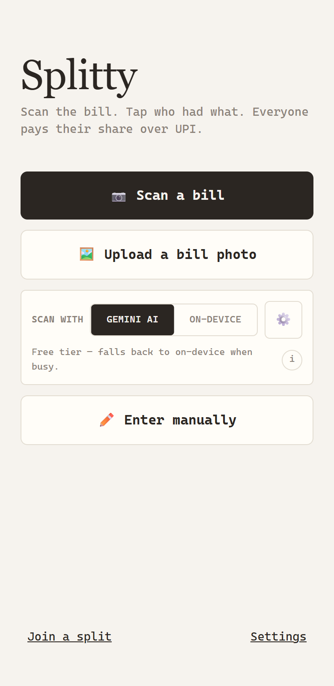
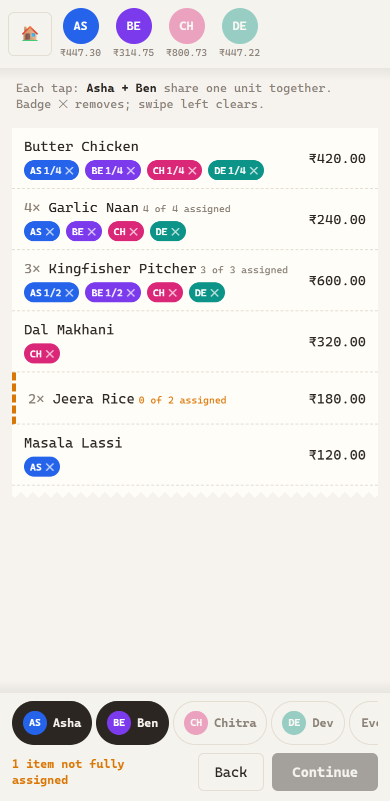
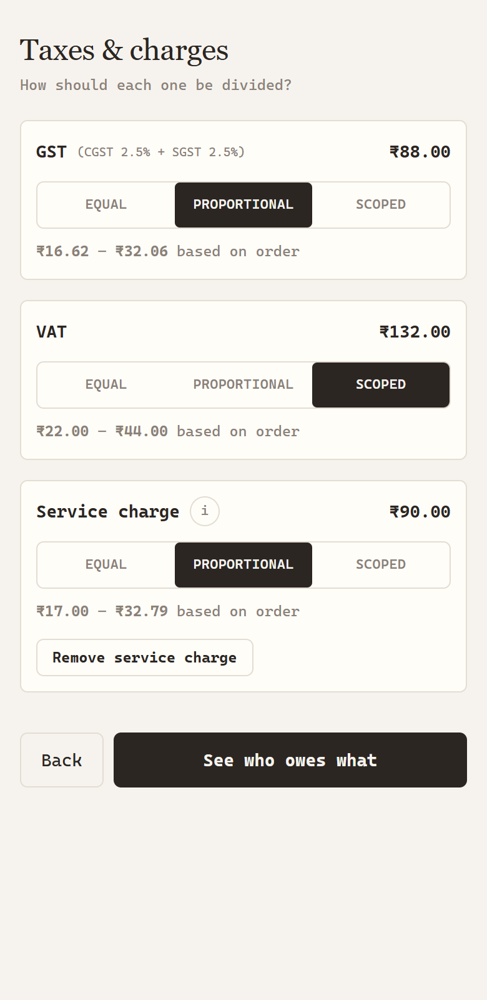
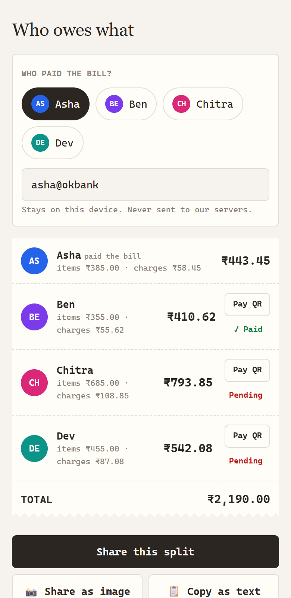

# Splitty 🧾

**Scan a restaurant bill. Tap who had what. Everyone pays their share over UPI.**

A zero-backend-state web app for the moment six people finish dinner, one person paid, and nobody
wants to do arithmetic. Photograph the bill, get structured line items, assign them with taps,
split taxes correctly (including liquor VAT scoped to drinkers), and settle with per-person UPI
QR codes.

| Home | Assigning | Charges | Settle up |
| --- | --- | --- | --- |
|  |  |  |  |

## Why it's different

- **Never broken.** Three scan tiers with silent fallback: your own Gemini key (browser → Google
  directly), a shared free-tier proxy, and on-device OCR (tesseract.js WASM). If everything is
  down, manual entry still works. There is no dead end.
- **Assignment is the product.** A multi-select "brush" in a bottom tray: pick one person and tap
  their items; pick two and each tap makes them **share one unit** (two people on one of three
  beers = ½ each, exact money). Fraction badges, per-item "2 of 3 assigned" progress, vibration +
  shake when a tap isn't possible.
- **The money reconciles, always.** Every division goes through one largest-remainder allocator —
  per-person totals sum to the bill total **to the paisa**, enforced by an invariant and a
  1000-run fuzz test. All money is integer paise; floats never touch an amount.
- **Indian bills, done right.** CGST+SGST collapse into one GST decision; liquor VAT is scoped to
  the people who actually drank; the service charge comes with a "not mandatory (CCPA 2022)"
  note and a one-tap remove.
- **Honest privacy.** Nothing is stored server-side except a shared split (30-day TTL) — no
  images, no API keys, no UPI IDs. Payment details ride in URL fragments, which never leave the
  browser. An "always on-device" toggle keeps photos on your phone entirely.

## Settling up

- **Per-person UPI QR:** tap a person → full-screen QR with their exact amount — they scan it from
  any UPI app. Android also gets a direct `upi://` intent button; iOS gets per-app buttons
  (GPay / PhonePe / Paytm).
- **Share the split:** one QR/link for the table — via a 6-char code (Vercel KV) or a fully
  serverless `lz-string` URL fragment. Recipients see live paid/pending status and can mark
  themselves paid.
- **Export:** a receipt-styled PNG of the whole breakdown (canvas-drawn, per person with share
  fractions) straight to WhatsApp via the native share sheet, or clean plain text.

## Stack

React + Vite + TypeScript · Tailwind v4 · zustand · motion · vaul · sonner · NumberFlow ·
input-otp · react-qr-code · lz-string · tesseract.js · Vercel serverless (Edge) + Upstash Redis.

## Getting started

```bash
npm install
npm run dev        # app at localhost:5173 — manual entry, BYOK scanning, on-device OCR,
                   # and fragment sharing all work with no backend at all
npm test           # split-engine suite incl. the paisa-exactness fuzz test
npm run build      # type-check + production build
```

The serverless pieces (`api/`) only run when deployed (or under `vercel dev`):
shared-key scanning with rate limiting, and code-based shares.

## Deploying to Vercel

1. Import the repo (framework: Vite). `vercel.json` carries the SPA rewrites and CSP headers.
2. **Storage → Create Database → Upstash for Redis**, connect it to the project — this injects
   `KV_REST_API_URL` / `KV_REST_API_TOKEN` automatically.
3. Add the remaining environment variables (see `.env.example`):

   | Variable | Purpose |
   | --- | --- |
   | `SHARED_GEMINI_KEY` | Free-tier Google AI Studio key. **Use a project with billing disabled** — worst case abuse then costs quota, not money |
   | `SHARED_GEMINI_MODEL` | Optional; defaults to `gemini-3.5-flash-lite` |
   | `DISABLE_RATE_LIMIT` | `true` only for local testing |

4. Deploy. The scan proxy is rate-limited to 3/IP/min; KV stores only rate-limit counters and
   computed splits.

## Project layout

```
src/lib/        split engine (allocate, computeSplit), money, UPI links, unit helpers
src/scan/       preprocess → engine router → gemini / tesseract + geometric layout parser
src/store/      zustand stores (bill, settings)
src/screens/    Home · People · Items · Assign · Charges · Summary · Settings · Join · Shared
src/share/      lz-string codec, PNG/text export
api/            Edge functions: /api/scan (rate-limited proxy), /api/split (+/:code)
```

Tests: `npx vitest run` — engine allocation cases, geometric parser, share codec round-trip.
API functions type-check via `npx tsc -p tsconfig.api.json`.
