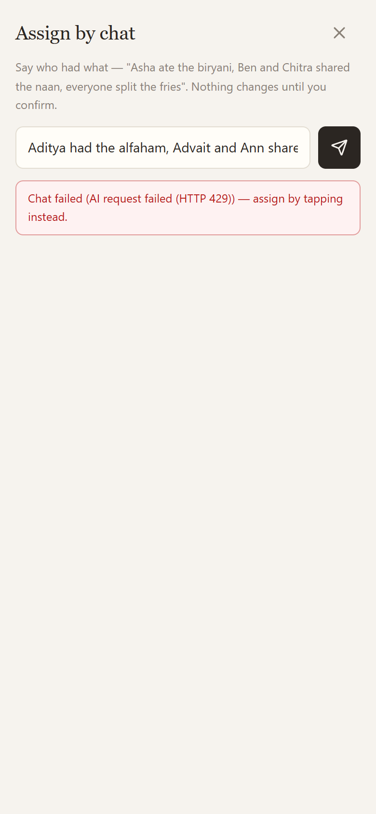
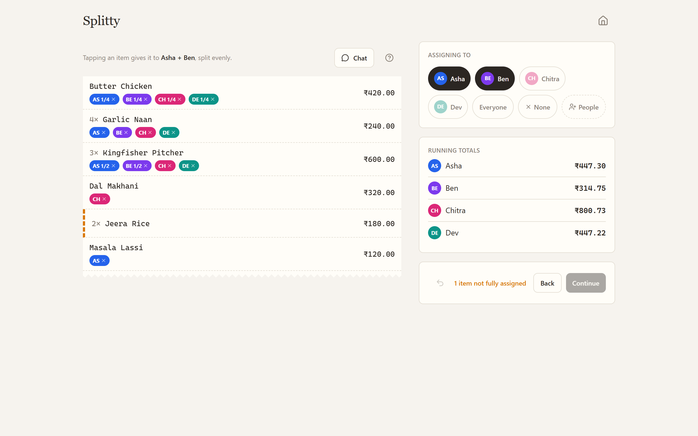

# Splitty 🧾

**Scan a restaurant bill. Tap who had what. Everyone pays their share over UPI.**

Six people finish dinner, one person paid, and nobody wants to do arithmetic. Splitty is a web
app with no backend state for exactly that moment: photograph the bill, get structured line
items, assign them with taps, split the taxes correctly (liquor VAT only hits the drinkers), and
settle with a UPI QR per person.

| Home | Assigning | Assign by chat | Charges | Settle up |
| --- | --- | --- | --- | --- |
|  |  |  |  |  |

On desktop the same flow spreads into two panes, receipt on the left with people, totals, and
actions in a sticky aside:



## Why it's different

It never dead-ends. Scanning tries your own Gemini key first (straight from the browser to
Google), then a shared free-tier proxy, then on-device OCR with tesseract.js WASM. If all three
are down you can still type the bill in by hand.

Assignment is the part competitors get wrong, so most of the work went there. The header answers
"how far am I" without being asked: a progress bar, the money nobody has claimed yet, and every
person's running total on a card that doubles as the control for picking them. You select whoever
shared a thing and tap the thing: it splits evenly among them in one tap. The ⋯ button expands a
row into exact portions with half-unit steppers, for nights when someone had two and two people
shared one — stepping someone to zero there takes them off the item. Swiping a row left clears
it, a single-level undo covers every change, and when a tap can't do anything the row shakes and
the phone buzzes instead of silently ignoring you.

If tapping is too much work, tap Chat and type "Asha ate the biryani, Ben and Chitra shared the
naan, everyone split the fries". The AI replies with a per-item proposal card, and nothing is
applied until you confirm it. This works with your own key or through the shared server tier.

The money always reconciles. Every division runs through one largest-remainder allocator, so
per-person totals sum to the bill total to the paisa. An invariant check and a 1000-run fuzz
test enforce it, and amounts are integer paise everywhere; floats never touch money.

Indian bills are handled properly: CGST and SGST collapse into a single GST decision, liquor VAT
is scoped to the people who drank, and the service charge carries a note that it isn't mandatory
(CCPA guidelines, 2022) next to a one-tap remove button.

Privacy claims here are literal, not aspirational. The server stores nothing except a shared
split with a 30-day TTL. No images, no API keys, no UPI IDs. Payment details travel in URL
fragments, which never leave the browser, and an "always on-device" toggle keeps photos on your
phone entirely.

## Settling up

- Tap a person and a full-screen QR appears with their exact amount, ready to scan from any UPI
  app. Android also gets a direct `upi://` intent button; iOS gets per-app buttons for GPay,
  PhonePe, and Paytm.
- One QR or link shares the whole split with the table, either as a 6-char code backed by Vercel
  KV or as a fully serverless `lz-string` URL fragment. Settlement syncs live in both directions,
  and sharing again after edits updates the stored split under the same code (only the creator's
  device holds the write key).
- Paid is two-sided, because it has to be: a UPI intent link reports to the payee's bank and
  never back to the page, so nothing here is a verified payment. Whoever owes says "I've sent
  it"; the person who fronted the bill confirms it arrived, and only they can. Opening a UPI app
  hands over the whole screen, and coming back is the one moment a browser learns anything at
  all — so that is when the shared view asks, instead of hoping someone remembers the checkbox.
- Exports go out as a receipt-styled PNG drawn on a canvas, per person with share fractions and
  the share link printed on it, straight to WhatsApp through the native share sheet. A clean
  plain-text version covers everything else.
- Recent splits stay on the device: live through their code for its 30-day life, then from the
  local snapshot. The app installs as a PWA on iOS, Android, and desktop.

## Stack

React + Vite + TypeScript · Tailwind v4 · zustand · motion · vaul · sonner · NumberFlow ·
lucide-react · input-otp · react-qr-code · lz-string · tesseract.js · Vercel serverless (Edge) +
Upstash Redis.

## Getting started

```bash
npm install
npm run dev        # app at localhost:5173 — manual entry, BYOK scanning, on-device OCR,
                   # and fragment sharing all work with no backend at all
npm test           # split-engine suite incl. the paisa-exactness fuzz test
npm run build      # type-check + production build
```

The serverless pieces in `api/` only run when deployed (or under `vercel dev`): shared-key
scanning and chat with rate limiting, plus code-based shares.

## Deploying to Vercel

1. Import the repo (framework: Vite). `vercel.json` carries the SPA rewrites and CSP headers.
2. Storage → Create Database → Upstash for Redis, then connect it to the project. This injects
   `KV_REST_API_URL` and `KV_REST_API_TOKEN` for you.
3. Add the remaining environment variables (see `.env.example`):

   | Variable | Purpose |
   | --- | --- |
   | `SHARED_GEMINI_KEY` | Free-tier Google AI Studio key. Use a project with billing disabled, so worst-case abuse costs quota, not money |
   | `SHARED_GEMINI_MODEL` | Optional; defaults to `gemini-3.6-flash` |
   | `DISABLE_RATE_LIMIT` | `true` only for local testing |

4. Deploy. The scan proxy is rate-limited to 3 requests per IP per minute, and KV stores only
   rate-limit counters and computed splits.

## Project layout

```
src/lib/        split engine (allocate, computeSplit), money, UPI links, unit + settle helpers
src/scan/       preprocess → engine router → gemini / tesseract + geometric layout parser
src/store/      zustand stores (bill, settings, history)
src/screens/    Home · People · Items · Assign · Charges · Summary · Settings · Join · Shared
src/share/      lz-string codec, PNG/text export
api/            Edge functions: /api/scan + /api/assign (rate-limited proxies), /api/split (+/:code)
```

Tests run with `npx vitest run` and cover the engine allocation cases, the geometric parser, and
the share codec round-trip. API functions type-check via `npx tsc -p tsconfig.api.json`.
